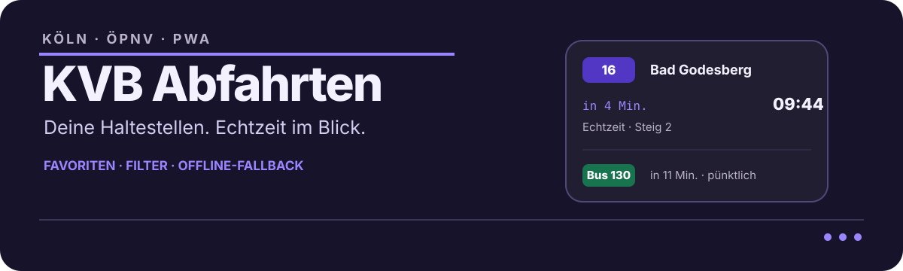

<p align="center">
  
</p>

<p align="center">
  <strong>Die nächste KVB-Abfahrt, ohne Umwege.</strong><br>
  Eine schnelle, installierbare PWA für Kölner Haltestellen.
</p>

<p align="center">
  <a href="https://github.com/heratik/kvb-abfahrten"></a>
  
  
</p>

## Was die App kann

KVB Abfahrten konzentriert sich auf den Moment unterwegs: Haltestelle öffnen, Linie auswählen, losgehen.

- aktuelle Abfahrten mit Uhrzeit, Echtzeit- und Fahrplanstatus
- Linien- und Richtungsfilter, Verspätungen, Ausfälle und Steig/Gleis
- Favoriten speichern, umbenennen, sortieren, teilen und offline wiederfinden
- Haltestellen suchen oder in der Nähe per Gerätestandort entdecken
- Störungsmeldungen, Light-/Darkmode und automatische Aktualisierung
- Service-Worker-Updates ohne Neuinstallation der PWA

## Ablauf

```text
KVB / HAFAS                 PHP-Proxy                 PWA
Abfahrten · Suche · Störung ───────────────▶  Favoriten · Filter · Offline
                                                        │
                                                        ▼
                                               Browser / Homescreen
```

Die App kommt ohne Frontend-Framework und ohne Build-Schritt aus. PHP-Endpunkte kapseln die KVB-Datenquelle; der Browser verwaltet Favoriten und den letzten bekannten Abfahrtsstand lokal.

## Schnellstart

```bash
git clone https://github.com/heratik/kvb-abfahrten.git
cd kvb-abfahrten
php -S localhost:8080
```

Dann [http://localhost:8080](http://localhost:8080) öffnen. Für die Standortsuche akzeptieren moderne Browser `localhost` als sicheren Kontext.

## API-Endpunkte

| Endpunkt | Zweck |
| --- | --- |
| [`api/stops.php`](api/stops.php) | Haltestellen suchen |
| [`api/departures.php`](api/departures.php) | Abfahrten laden |
| [`api/nearby.php`](api/nearby.php) | Haltestellen in der Nähe |
| [`api/disruptions.php`](api/disruptions.php) | Störungen laden |

## Datenschutz und Betrieb

Favoriten und Theme-Einstellung bleiben im `localStorage` des Browsers. Standortdaten werden erst nach Zustimmung genutzt. Abfahrts-, Such- und Störungsdaten werden über die PHP-API von den konfigurierten KVB-Diensten abgerufen.

Die App ist für einen PHP-fähigen Webserver gedacht. Für neue Releases wird die Cache-Version in [`sw.js`](sw.js) erhöht; installierte PWAs übernehmen die neue App-Shell anschließend ohne Neuinstallation.

## Lizenz

Aktuell ist keine separate Lizenzdatei hinterlegt.

<p align="center"><sub>Made with ♥ in Cologne by <a href="https://ekrem.eu">ekrem.eu</a></sub></p>
